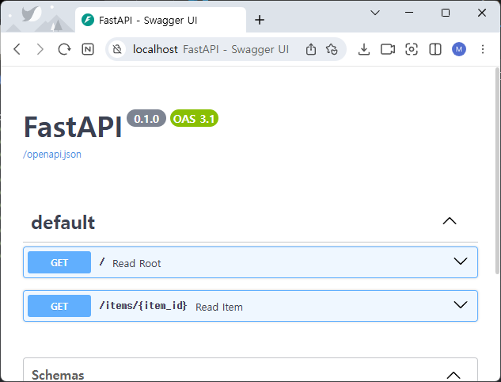

# FastAPI with uv 실습

- Window의 Powershell에서 uv 설치
```powershell
 powershell -ExecutionPolicy ByPass -c "irm https://astral.sh/uv/install.ps1 | iex"
```

- 프로젝트 디렉토리 생성 및 초기화
```powershell
PS C:\GitHub\D2504_FastAPI_uv\code> mkdir fapi
PS C:\GitHub\D2504_FastAPI_uv\code> cd fapi
PS C:\GitHub\D2504_FastAPI_uv\code\fapi> uv init
PS C:\GitHub\D2504_FastAPI_uv\code\fapi> 
PS C:\GitHub\D2504_FastAPI_uv\code\fapi> ls -force
    디렉터리: C:\GitHub\D2504_FastAPI_uv\code\fapi
Mode                 LastWriteTime         Length Name
----                 -------------         ------ ----
-a----      2025-04-30   오후 6:59              5 .python-version
-a----      2025-04-30   오후 6:59             82 main.py
-a----      2025-04-30   오후 6:59            150 pyproject.toml
-a----      2025-04-30   오후 6:59              0 README.md

```

[fapi/pyproject.toml]
```toml
[project]
name = "fapi"
version = "0.1.0"
description = "Add your description here"
readme = "README.md"
requires-python = ">=3.12"
dependencies = []

```

[fapi/main.py]
```python
def main():
    print("Hello from fapi!")


if __name__ == "__main__":
    main()

```

- 실행
```powershell
PS C:\GitHub\D2504_FastAPI_uv\code\fapi> uv run .\main.py
Using CPython 3.12.7 interpreter at: C:\Python\Anaconda3\python.exe
Creating virtual environment at: .venv
Hello from fapi!
PS C:\GitHub\D2504_FastAPI_uv\code\fapi>

```

- 패키지 설치 : fastapi, uvicorn
```powershell
PS C:\GitHub\D2504_FastAPI_uv\code\fapi> uv add fastapi uvicorn
Resolved 15 packages in 308ms
Prepared 14 packages in 563ms
Installed 14 packages in 91ms
 + annotated-types==0.7.0
 + anyio==4.9.0
 + click==8.1.8
 + colorama==0.4.6
 + fastapi==0.115.12
 + h11==0.16.0
 + idna==3.10
 + pydantic==2.11.4
 + pydantic-core==2.33.2
 + sniffio==1.3.1
 + starlette==0.46.2
 + typing-extensions==4.13.2
 + typing-inspection==0.4.0
 + uvicorn==0.34.2
PS C:\GitHub\D2504_FastAPI_uv\code\fapi>

```
[fapi/pyproject.toml]
```toml
[project]
name = "fapi"
version = "0.1.0"
description = "Add your description here"
readme = "README.md"
requires-python = ">=3.12"
dependencies = [
    "fastapi>=0.115.12",
    "uvicorn>=0.34.2",
]
```

- 코드작성
[main.py]
```python
import uvicorn

def main():
    uvicorn.run(app="app:app", host="0.0.0.0", port=8080, reload=True)   

if __name__ == "__main__":
    main()

```

[app.py]
```python
from fastapi import FastAPI
from typing import Union

app = FastAPI()

@app.get("/")
def read_root():
    return {"Hello": "World"}

@app.get("/items/{item_id}")
def read_item(item_id: int, q: Union[str, None] = None):
    return {"item_id": item_id, "q": q}

```

- 실행
```powershell
PS C:\GitHub\D2504_FastAPI_uv\code\fapi> uv run .\main.py
INFO:     Will watch for changes in these directories: ['C:\\GitHub\\D2504_FastAPI_uv\\code\\fapi']
INFO:     Uvicorn running on http://0.0.0.0:8080 (Press CTRL+C to quit)
INFO:     Started reloader process [29184] using StatReload
INFO:     Started server process [28676]
INFO:     Waiting for application startup.
INFO:     Application startup complete.

```

- 결과 : http://localhost:8080
```
{
  "Hello": "World"
}
```

- 결과 : http://localhost:8080/items/69?q=v파라메타
```
{
  "item_id": 69,
  "q": "파라메타"
}
```

- 문서 보기
http://localhost:8080/docs




- 환경설정 파일 생성
[config/config.py]
```python
# config/config.py

PORT = 8080

```
[main.py]
```python
import uvicorn
from config import config

def main():
    uvicorn.run(app="app:app", host="0.0.0.0", port=config.PORT, reload=True)

if __name__ == "__main__":
    main()

```

